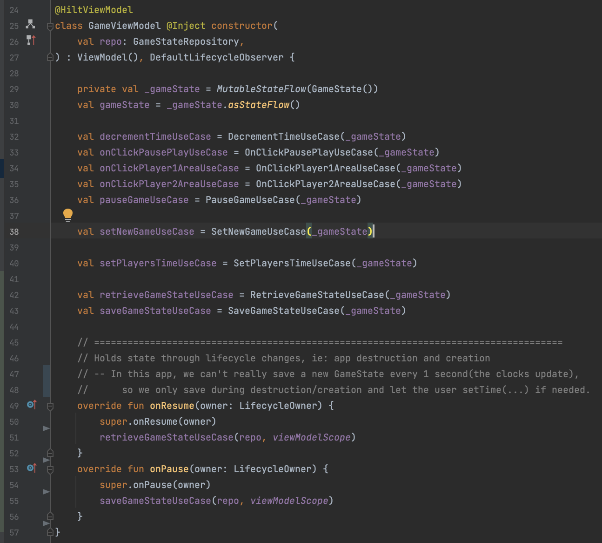

This project was created to showcase the following:

(1) CLEAN Architecture
	- data layer
	- domain layer
	- ui layer

(2) Dependency Injection using Hilt/Dagger

(3) Test libraries
	- JUnit
	- Mockito
	- Robolectric
	- Espresso
	- Compose UI testing(NEW)

The purpose of this app is to help me find a job.
Oh yeah you can use it as a chess clock app, too.

I accept payment in the form of money,
Cheers

